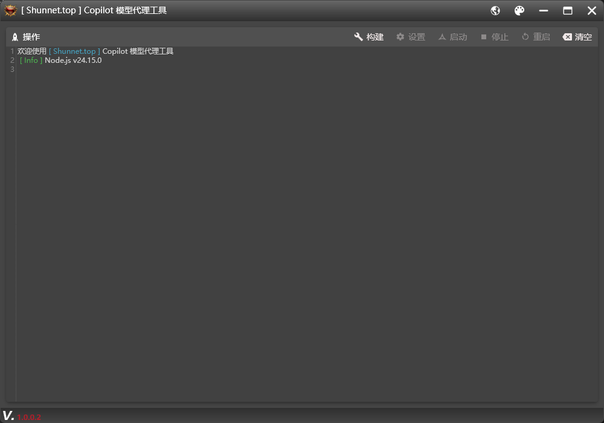
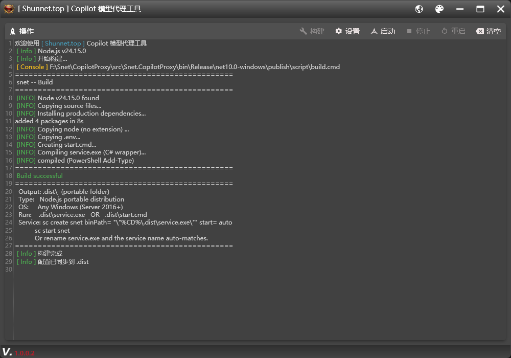
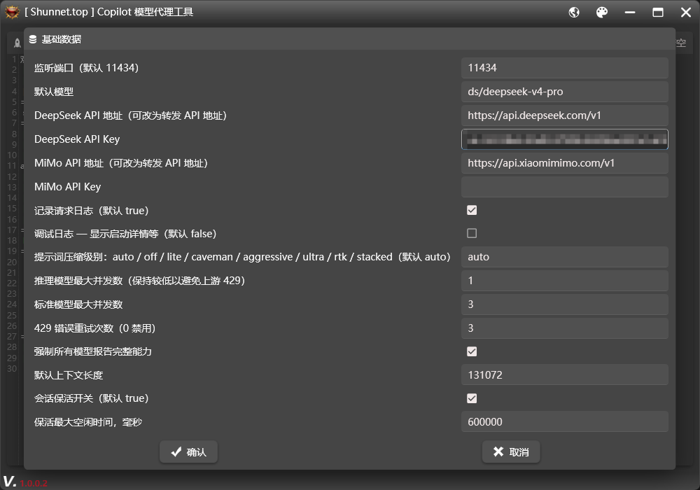
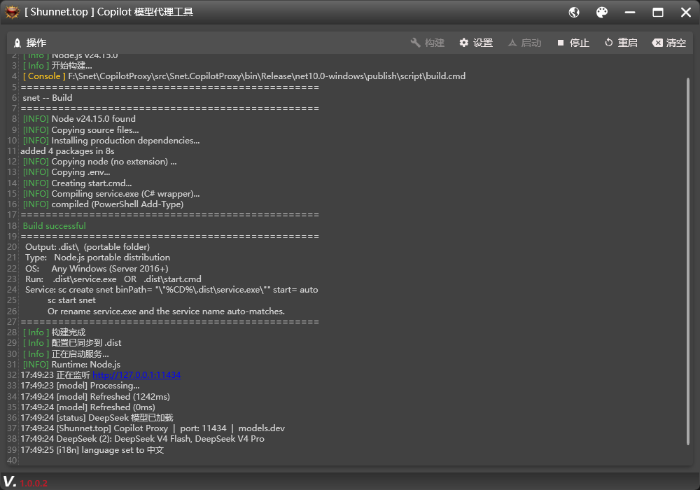
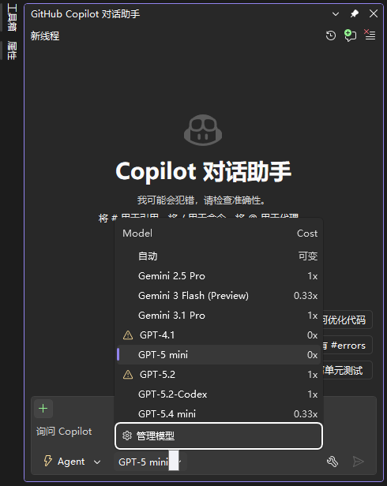
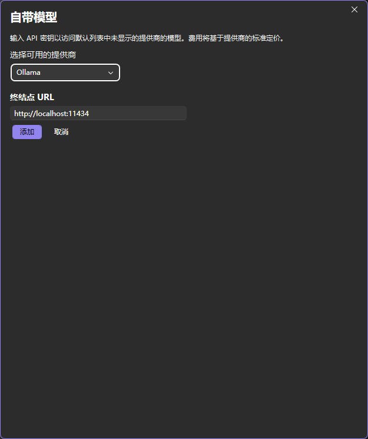
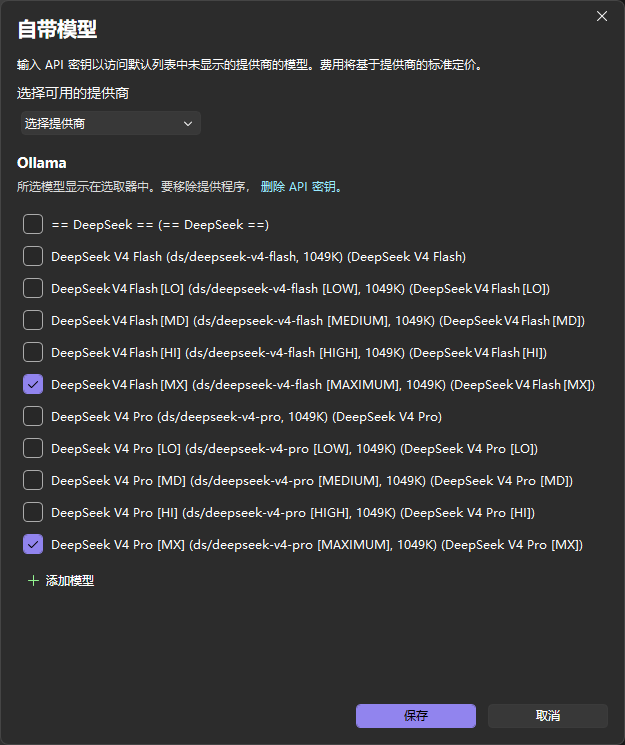
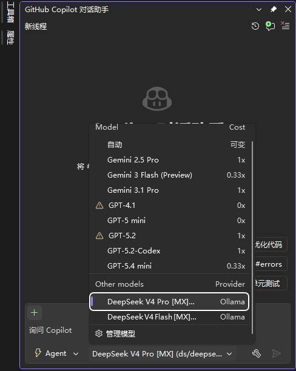
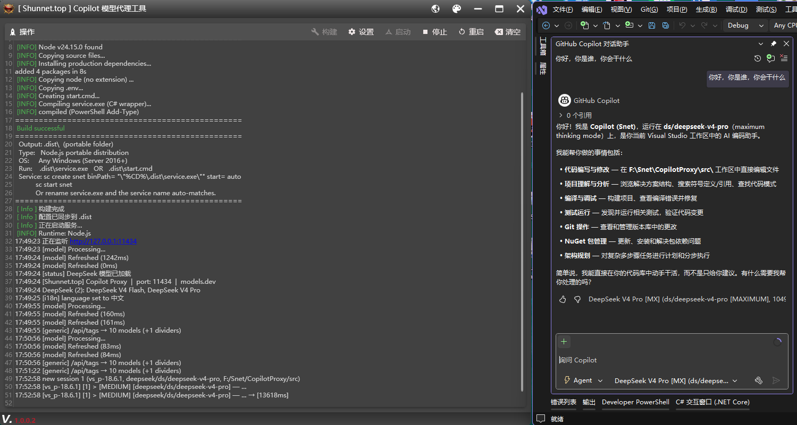

<h1 align="center">
  <br/>
  📦 CopilotProxy
</h1>

<p align="center">
  <b>🛠️ 多模型 AI 代理 — 将 GitHub Copilot 连接到 DeepSeek & 小米 MiMo</b>
</p>

<p align="center">
  
  
  
  
</p>

<p align="center">
  <a href="https://shunnet.top"><b>🌐 官方网站</b></a> ·
  <a href="https://www.nuget.org/profiles/shun"><b>📚 NuGet</b></a> ·
  <a href="https://github.com/shunnet"><b>💻 GitHub</b></a>
</p>

## 📖 项目介绍

CopilotProxy 是一个**本地代理服务**，在 GitHub Copilot 与国产大模型（DeepSeek、小米 MiMo）之间架起桥梁。它模拟 Ollama 的 API 协议，让 Visual Studio 2026 和 VS Code 中的 Copilot Chat / Agent 能直接使用 DeepSeek V4 Pro/Flash 和 MiMo V2.5 系列模型，无需修改 IDE 任何配置。

**它解决什么问题？**

GitHub Copilot 默认仅支持 OpenAI / Anthropic 等海外模型。对于国内用户，DeepSeek 和小米 MiMo 在中文代码理解、推理能力、成本方面具有明显优势，但 Copilot 无法直接连接。CopilotProxy 作为一个本地中间层，实现了协议转换、智能提示词压缩、会话管理、工具调用标准化、技能自动匹配等功能，让国产模型无缝接入 Copilot 生态。

**WPF 桌面管理工具**提供了可视化的一键操作界面——配置 API Key、构建部署、启动/停止/重启服务、查看实时日志，无需接触命令行。脚本服务端则负责实际的 API 转发、压缩、会话保活和并发控制。

## ✨ 功能亮点

<table>
<tr><td>🔌 <b>多模型支持</b></td><td>DeepSeek V4 Pro / Flash + 小米 MiMo V2.5 系列</td></tr>
<tr><td>🖥️ <b>WPF 桌面管理</b></td><td>可视化配置 API Key、一键构建、启动/停止/重启、实时日志</td></tr>
<tr><td>🌍 <b>中英文国际化</b></td><td>WPF 与脚本服务双向语言同步，默认中文</td></tr>
<tr><td>🪟 <b>单实例 + 托盘</b></td><td>Mutex + NamedPipe 确保唯一实例，关闭到托盘，新启动唤醒已有窗口</td></tr>
<tr><td>🔄 <b>Ollama 协议兼容</b></td><td>模拟 Ollama API，VS 2026 / VS Code 原生接入</td></tr>
<tr><td>🧠 <b>推理模式</b></td><td>支持 LOW / MEDIUM / HIGH / MAXIMUM 四档思考强度</td></tr>
<tr><td>📦 <b>提示词压缩</b></td><td>9 级可选（off / lite / caveman / rtk / ultra / delta / stacked / aggressive / standard），默认关闭</td></tr>
<tr><td>💬 <b>会话保活</b></td><td>自动维持 KV Cache，降低 API 费用</td></tr>
<tr><td>📚 <b>技能系统</b></td><td>317 个编码技能（来自 ECC + superpowers + dotnet/skills），自动匹配对话上下文注入相关模式</td></tr>
<tr><td>📊 <b>Token 用量</b></td><td>每轮对话实时输出 [token] prompt/completion/total 日志</td></tr>
<tr><td>🌐 <b>透传代理</b></td><td>未匹配路由可转发到自定义上游 API（含 SSRF 防护 + 超时控制）</td></tr>
<tr><td>🔧 <b>工具调用</b></td><td>完整的 Function Calling 支持，Schema 自动校验补全，智能 JSON 修复</td></tr>
<tr><td>🛡️ <b>安全可靠</b></td><td>SSRF 防护、终端命令白名单、API Key 安全存储</td></tr>
<tr><td>🔍 <b>版本检测</b></td><td>一键检查 GitHub 最新版本，自动比对提示更新</td></tr>
</table>

## 📋 系统要求

| 组件 | 说明 |
|------|------|
| 🟢 **Node.js** | 脚本运行时（自动检测版本，未安装时提示下载） |
| 🔵 **Visual Studio 2026** (18.6.0+) | Ollama 提供程序支持 |
| 🟣 **Windows 10+** | WPF 桌面管理工具 |
| 🟡 **API Key** | DeepSeek 或 MiMo 至少配置一个 |

## 🚀 快速开始

### 1️⃣ 配置 API Key

打开 WPF 管理工具 → 点击 **设置** → 填入 API Key：

```env
# DeepSeek API（https://platform.deepseek.com/api_keys）
DEEPSEEK_API_KEY=sk-your-deepseek-key

# 小米 MiMo API（https://platform.xiaomimimo.com/#/console/api-keys）
MIMO_API_KEY=sk-your-mimo-key
```

> 💡 配置后自动同步到 `script/.env` 和 `.dist/.env`。服务运行时保存配置会自动重启以应用新配置。

### 2️⃣ 构建 & 启动

在 WPF 工具中依次点击 **构建** → **启动**，或在终端中：

```bash
start.cmd          # Windows（双击运行）
bun run start      # Bun（推荐）
npm run node       # Node.js 备选
```

### 3️⃣ 添加到 Visual Studio

> 需要 Visual Studio 2026 **18.6.0+**（正式版或 Insiders）

1. 打开 Copilot Chat 面板
2. 点击模型下拉菜单 → **管理模型**
3. 选择提供程序 → **Ollama**
4. 端点保持 `http://localhost:11434`
5. 点击 **添加** — 模型自动加载

### 4️⃣ 添加到 VS Code

1. 安装 GitHub Copilot 扩展
2. Copilot Chat → 模型下拉 → **管理模型**
3. 选择提供程序 → **Ollama**
4. 输入 `http://localhost:11434` 作为端点
5. 点击 **添加** — 模型以 `[DEEPSEEK]` / `[MIMO]` 前缀出现

## 🤖 支持模型

### DeepSeek

| 模型 | 上下文 | 工具调用 | 推理模式 |
|------|---------|---------|----------|
| 🔮 **DeepSeek V4 Pro** | 1M | ✅ | LOW · MEDIUM · HIGH · MAXIMUM |
| ⚡ **DeepSeek V4 Flash** | 1M | ✅ | LOW · MEDIUM · HIGH · MAXIMUM |

### 小米 MiMo

| 模型 | 上下文 | 工具调用 | 视觉 |
|------|---------|---------|------|
| 🎯 **MiMo V2.5** | 1M | ✅ | ✅ |
| 🎯 **MiMo V2.5 Pro** | 1M | ✅ | ✅ |
| 🎤 **MiMo V2.5 TTS** | 262K | ✅ | ✅ |

## ⚙️ 配置参数

### 核心配置

| 变量 | 默认值 | 说明 |
|------|--------|------|
| `DEEPSEEK_BASE_URL` | `https://api.deepseek.com` | DeepSeek API 地址 |
| `MIMO_BASE_URL` | `https://api.xiaomimimo.com/v1` | MiMo API 地址 |
| `DEEPSEEK_API_KEY` | — | DeepSeek API Key |
| `MIMO_API_KEY` | — | MiMo API Key |
| `DEFAULT_MODEL` | `ds/deepseek-v4-pro` | 默认模型 |
| `SERVER_HOST` | `127.0.0.1` | 绑定地址 |
| `SERVER_PORT` | `11434` | 监听端口 |

### 日志与调试

| 变量 | 默认值 | 说明 |
|------|--------|------|
| `REQUEST_LOG` | `true` | 请求日志 |
| `DEBUG` | 不设置 | 调试模式（设 `true` 或 `1` 开启） |

### 压缩与性能

| 变量 | 默认值 | 说明 |
|------|--------|------|
| `COMPRESSION_LEVEL` | `off` | 压缩级别（off / lite / caveman / rtk / ultra / delta / stacked / aggressive / standard） |
| `CONCURRENCY_THINKING` | `1` | 推理模型最大并发 |
| `CONCURRENCY_STANDARD` | `3` | 标准模型最大并发 |
| `RETRY_MAX` | `3` | 429 错误重试次数 |
| `THINKING_TIMEOUT_MS` | `120000` | 推理模型超时（毫秒） |
| `REQUEST_TIMEOUT_MS` | `120000` | 请求超时（毫秒） |
| `TRUNCATE_TOOL_OUTPUT` | `true` | 工具输出截断 |
| `MAX_TOOL_OUTPUT_CHARS` | `12000` | 工具输出最大字符数 |

### 模型与上下文

| 变量 | 默认值 | 说明 |
|------|--------|------|
| `DEFAULT_CONTEXT_LENGTH` | `131072` | 默认上下文长度（Token） |
| `DEFAULT_TEMPERATURE` | 留空 | 采样温度（留空 = 模型默认） |

### 会话保活

| 变量 | 默认值 | 说明 |
|------|--------|------|
| `SESSION_KEEPALIVE_ENABLED` | `true` | 会话保活开关 |
| `SESSION_KEEPALIVE_INTERVAL_MS` | `120000` | 保活 Ping 间隔（毫秒） |
| `SESSION_KEEPALIVE_IDLE_TIMEOUT_MS` | `600000` | 保活空闲超时（毫秒） |
| `SESSION_KEEPALIVE_MAX_LIFETIME_MS` | `86400000` | 保活最大生命周期（毫秒） |

### 技能与语言

| 变量 | 默认值 | 说明 |
|------|--------|------|
| `SKILLS_DIR` | 留空 | 自定义技能目录（留空 = 自动检测） |
| `SNET_LANGUAGE` | `zh` | 界面语言（zh / en） |

### 透传与安全

| 变量 | 默认值 | 说明 |
|------|--------|------|
| `PASSTHROUGH_BASE_URL` | 留空 | 透传上游地址（留空 = 不启用） |
| `TERMINAL_FALLBACK_ENABLED` | `false` | 终端命令回退（⚠️ 需信任 AI 客户端） |

## 🌐 API 端点

| 端点 | 方法 | 说明 |
|------|------|------|
| `/api/tags` | GET | Ollama 模型列表（含推理模式变体） |
| `/v1/chat/completions` | POST | 聊天补全（流式、工具调用、技能匹配） |
| `/api/chat` | POST | Ollama /api/chat 兼容（流式、工具调用） |
| `/api/generate` | POST | Ollama /api/generate 兼容 |
| `/v1/models` | GET | OpenAI 格式模型列表 |
| `/api/language` | GET/POST | 获取/设置脚本语言 |
| `/health` | GET | 健康检查 |
| `/api/refresh` | POST | 强制刷新模型列表 |
| `/api/version` | GET | 服务版本 |
| `/api/ps` | GET | 进程/模型状态 |
| `/stop` | GET | 优雅关闭服务 |

## ⌨️ WPF 界面操作

| 按钮 | 操作 | 快捷键 |
|------|------|--------|
| 🏗️ 构建 | 编译打包脚本到 .dist | — |
| ⚙️ 设置 | 配置 API Key、模型参数 | — |
| ▶️ 启动 | 启动代理服务 | — |
| ⏹️ 停止 | 优雅关闭（HTTP /stop → 精准杀进程） | — |
| 🔄 重启 | 停止 → 等待 → 启动 | — |
| 🔧 重建 | 停止 → 删除 .dist → 重新构建 | — |
| 🔍 检查更新 | GitHub Releases API 比对版本号 | — |
| 🧹 清空 | 清除日志显示 | — |

## 🏗️ 技术架构

```
┌─────────────────────────────────┐
│   WPF 桌面管理工具 (.NET 10)       │
│  ┌─────────┐ ┌─────────┐        │
│  │ 配置管理  │ │ 实时日志  │        │
│  └─────────┘ └─────────┘        │
│  ┌─────────┐ ┌─────────┐        │
│  │ 构建部署  │ │ 服务控制  │        │
│  └─────────┘ └─────────┘        │
└──────────────┬──────────────────┘
               │ 进程管理 (精准 PID 追踪) + 语言同步
               ▼
┌─────────────────────────────────┐
│   代理服务 (Node.js / Bun)        │
│  ┌───────────────────────────┐  │
│  │  Ollama 兼容 API (Hono)    │  │
│  ├───────────────────────────┤  │
│  │  技能匹配 · 提示词压缩        │  │
│  │  会话保活 · 工具调用标准化     │  │
│  │  Token 日志 · 中英文 i18n   │  │
│  │  透传代理 · 终端命令回退      │  │
│  ├───────────────────────────┤  │
│  │  DeepSeek / MiMo API 适配   │  │
│  └───────────────────────────┘  │
└─────────────────────────────────┘
```

## 📁 项目结构

```
CopilotProxy/
├── .github/workflows/
│   └── release.yml                # GitHub Actions 自动发版
├── image/                         # 界面截图
├── src/                           # WPF 管理工具 & 代理脚本
│   ├── App.xaml / App.xaml.cs     # 应用入口 & 全局异常捕获 & 单实例
│   ├── MainWindow.xaml / .cs      # 主窗口 UI & AvalonEdit 日志控件
│   ├── MainWindowModel.cs         # MVVM ViewModel（构建/设置/启停/检查更新）
│   ├── AssemblyInfo.cs            # 主题资源声明
│   ├── Language.resx              # 中文本地化资源
│   ├── Language.en.resx           # 英文国际化资源
│   ├── handler/
│   │   ├── CmdHandle.cs           # CMD 脚本进程管理 & ANSI 转义过滤
│   │   ├── EnvHandle.cs           # .env 配置读写 & 双向同步
│   │   └── SingleInstanceHandle.cs # 单实例管理（Mutex + NamedPipe）
│   ├── models/
│   │   └── EnvConfigModel.cs      # 配置模型（含 DataAnnotations 验证）
│   ├── script/
│   │   ├── start.cmd              # 启动脚本（自动检测 Bun/Node）
│   │   ├── build.cmd              # 构建入口（分发到 build-bun/build-node）
│   │   ├── build-bun.cmd          # Bun 编译为单文件 .exe
│   │   ├── build-node.cmd         # Node.js 可移植构建
│   │   ├── package.json           # npm 依赖声明
│   │   └── src/
│   │       ├── server.js          # 主服务入口 & Hono HTTP 路由 & 仪表盘 TUI
│   │       ├── snet-handle.js     # 模型管理 & API 请求 & 聊天补全
│   │       ├── skill-loader.js    # 技能加载（317 个）& 自动匹配 & 上下文注入
│   │       ├── token-optimizer.js # 9 级提示词压缩引擎
│   │       ├── concurrency.js     # 并发队列管理 & 指数退避重试 & 工具截断
│   │       ├── tool-extractor.js  # AI 文本中提取工具调用 & Schema 补全
│   │       ├── tool-schemas.js    # VS/VSCode 工具 Schema 定义 & 标准化
│   │       ├── stream-handler.js  # 流式响应处理 & 推理内容管理
│   │       ├── message-pipeline.js # 消息清理 & 孤立工具调用剥离
│   │       ├── reasoning-cache.js # 跨请求推理缓存（工作区感知）
│   │       ├── reasoning-replay.js # 推理内容回放 & 注入
│   │       ├── session-tracker.js # 会话注册 & 工作区摘要 & 速率限制
│   │       ├── session-keepalive.js # 会话保活（KV Cache 维持）
│   │       ├── logger.js          # 控制台仪表盘日志（滚动/折叠）
│   │       ├── i18n.js            # 中英文国际化（156+ key）
│   │       ├── deepseek-client.js # DeepSeek API 封装
│   │       ├── mimo-client.js     # MiMo API 封装
│   │       ├── win-service.js     # Windows 服务集成（bun:ffi + SCM）
│   │       ├── polyfill.js        # 跨运行时兼容层（Bun/Node）
│   │       └── skills/            # 317 个编码技能（SKILL.md）
```

## 🔧 高级特性

### 🌍 中英文国际化
- WPF 切换语言 → 自动同步脚本服务（`POST /api/language`）
- 启动时通过 `SNET_LANGUAGE` 环境变量预设语言
- 默认中文，覆盖 156+ 个翻译 Key：服务状态、API 错误、保活、技能、Token 日志、透传等

### 📚 技能系统
- **317 个编码技能**：来自 ECC + obra/superpowers + awesome-skills/code-review-skill + dotnet/skills
- **自动匹配**：基于用户消息内容（685 个中英文关键词），自动匹配相关技能注入系统提示词
- **会话缓存**：同一会话只匹配一次，后续请求直接复用
- **Token 优化**：每次只注入 Top 3 最相关技能，控制上下文消耗

### 🧠 推理内容管理
- 推理模型自动回传 `reasoning_content`（API 要求）
- 非推理模型自动剥离（避免 400 错误）
- 跨会话推理缓存（工作区感知）
- 推理回退检测：连续空思考自动切换策略

### 📏 上下文自动压缩
- 重复文件读取去重（仅保留最新）
- 超长工具结果截断（Head + Tail 策略）
- 旧消息摘要注入（`<compact-summary>` 模式）
- 9 级压缩可选，默认关闭

### 🔄 智能重试
- 指数退避 + 随机抖动
- 429 / 502 / 503 / 504 自动重试
- DeepSeek `reasoning_content` 错误特殊恢复
- 并发队列超时保护

### 🔧 工具调用 Schema 自动补全
- `tool-schemas.js` 定义了 VS 2026 / VS Code 所有工具的正确参数 Schema
- `normalizeToolCall` 使用 Schema 自动补全 AI 生成的缺失/错误参数
- VS `type: "custom"` 工具调用自动转换为标准 `type: "function"` 格式
- 新增工具只需在 Schema 文件加一行，无需手写正则

### 📊 Token 用量日志
- 每轮对话自动输出 `[token] request:N response:N total:N`
- 覆盖所有路径：流式/非流式/错误/速率限制
- 支持中英文格式，跟随语言设置切换

### 📝 C# 日志集成（`--plain` 模式）
C# 管理工具启动脚本时自动传入 `--plain` 参数与 `SNET_PLAIN=1` 环境变量，禁用 TUI 仪表盘，ANSI 转义码自动过滤，输出干净的文本日志。

## 🛠️ 构建独立包

| 脚本 | 说明 |
|------|------|
| `build.cmd` | 自动检测运行时（Bun / Node.js） |
| `build-bun.cmd` | 编译为单文件 `.exe`（需要 Bun） |
| `build-node.cmd` | 可移植文件夹（需要 Node.js） |

## 📸 界面截图

<p align="center">
  
  
</p>
<p align="center">
  
  
</p>
<p align="center">
  
  
</p>
<p align="center">
  
  
</p>
<p align="center">
  
</p>

<p align="center">
  <sub>Made with ❤️ by <a href="https://shunnet.top">Shunnet.top</a></sub>
</p>
